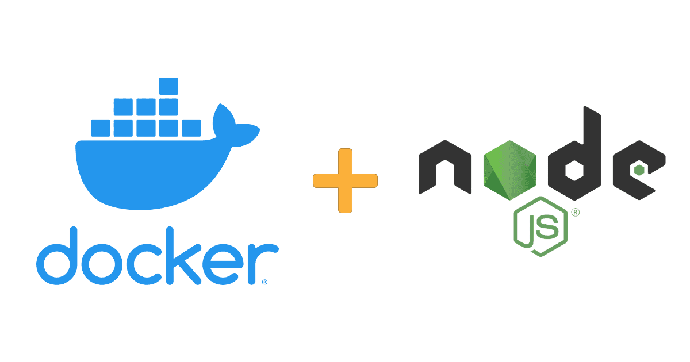
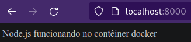

# Sprint 1
# Contêiner docker para Node.js
Atividade proposta na Sprint I do programa de bolsas da compass.UOL

<div align="center">
  
</div>

---

# Sumário
* [`Ferramentas utilizadas`](#ferramentas-utilizadas)
* [`Desenvolvimento`](#desenvolvimento)
* [`Referências`](#referências)

# Ferramentas utilizadas
* [`Node.js`](https://nodejs.org/en/)
* [`Docker`](https://www.docker.com/)

# Desenvolvimento
1. Criação da pasta onde o projeto ficará armazenado. Por exemplo **express_app**
2. Adição de um arquivo **app.js**
```js
// Importação e criação de um app express
const express = require('express');
const app = express()
  
// Mensagem para confirmação do sucesso na instalação do contêiner
msg = "Node.js funcionando no contêiner docker"
// Direcionando o express para a raiz da aplicação
app.get('/', (req, res) => res.send(msg));
  
// Rodando a aplicação na porta 3000
app.listen(3000, () => {
    console.log("app running on port 3000...");
})
```
3. Incializando o projeto node
```
npm init
```
Isso fará com que as informações referentes ao projeto, como versões e dependências sejam salvas em um arquivo **package.json**

4. Instalação da biblioteca **express** no arquivo **package.json**
```
npm install --save express
```
5. Instalação da ferramenta **nodemon** para detectar quaisquer mudanças feitas no node
```
npm install --save nodemon
```
> As dependências instaladas no passos 4 e 5 servem para salvar a informação no **package.json** e baixá-las eventualmente ao executar a imagem em um contêiner do docker

6. Adicionando os seguintes dados no arquivo **package.json** para o mesmo ser executado com o **nodemon**
```json
{
  "name": "express_app",
  "version": "1.0.0",
  "description": "",
  "main": "app.js",
  "scripts": {
    "start": "nodemon app.js",
    "test": "echo \"Error: no test specified\" && exit 1"
  },
  "author": "",
  "license": "ISC",
  "dependencies": {
    "express": "^4.18.2",
    "nodemon": "^2.0.20"
  }
}
```
7. Para adicionar as instruções em uma imagem, que será utilizada na criação do contêiner, é necessário a criação de um arquivo **Dockerfile** com os seguintes comandos:
```Dockerfile
# Representa o nome da imagem e a sua versão
FROM node:latest

# Contém o diretório do software no contêiner
WORKDIR /app

# Copia os arquivos do 'package.json' para o diretório do aplicativo '/app'
COPY package.json /app

# Executa o comando informado para instalar as dependências informadas no package.json
RUN npm install

# Copia os arquivos restante para o diretório mencionado do contêiner
COPY . /app

# Script para executar o aplicativo
CMD ["npm", "start"]
```
> Cada uma das instruções contidas no **Dockerfile** são consideradas camadas *(layers)* da imagem, isso permite que qualquer alteração feita em um dos comandos acima afetará somente as camadas depois da linha atualizada. Dessa forma, os comandos não afetados permanecem em cache, o que promove uma *build* mais rápida da nova imagem.

8. Construindo a imagem
```
docker build -t docker-container-nodejs .
```

> A *flag* **-t** tem a função de nomear a imagem e o **.** indica onde o **Dockerfile** está localizado, que nesse caso é o diretório atual.

- Para listar todas as imagens criadas basta rodar o comando (a imagem mais recente se localiza no topo):
```
docker images
```
9. Executando um contêiner com a imagem criada
```
docker run -d -p 8000:3000 -v endereço_do_app_localmente:/app docker-container-nodejs
```

> *Flags*
> - -d = roda em background
> - -p = especifica as portas do <span style="text-decoration: underline">host:contêiner</span>
> - -v = monta os arquivos do software no diretório do aplicativo do contêiner

10. No endereço **localhost:8000** está o **Node.js** sendo executado no docker


# Referências
Esse projeto foi baseado no guia da [`acervo lima`](https://acervolima.com/docker-docker-container-para-node-js/)
